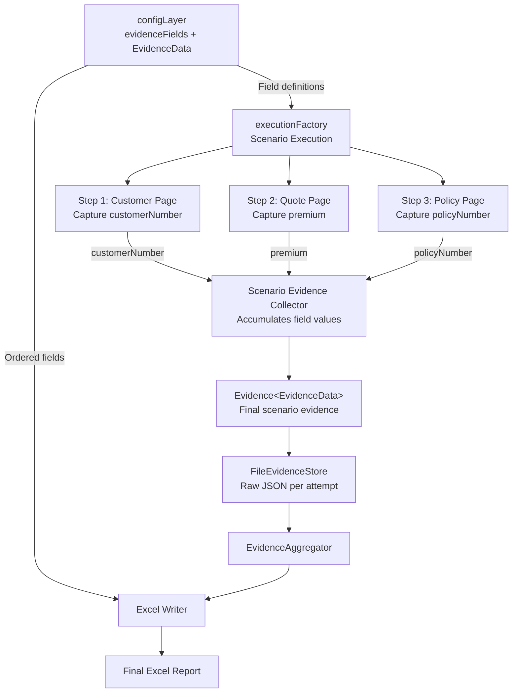

```mermaid

flowchart TD
    CONFIG["configLayer<br/>evidenceFields + EvidenceData"]

    EXEC["executionFactory<br/>Scenario Execution"]

    STEP1["Step 1: Customer Page<br/>Capture customerNumber"]
    STEP2["Step 2: Quote Page<br/>Capture premium"]
    STEP3["Step 3: Policy Page<br/>Capture policyNumber"]

    COLLECTOR["Scenario Evidence Collector<br/>Accumulates field values"]

    ENVELOPE["Evidence&lt;EvidenceData&gt;<br/>Final scenario evidence"]

    STORE["FileEvidenceStore<br/>Raw JSON per attempt"]

    AGG["EvidenceAggregator"]
    WRITER["Excel Writer"]
    REPORT["Final Excel Report"]

    CONFIG -->|"Field definitions"| EXEC
    CONFIG -->|"Ordered fields"| WRITER

    EXEC --> STEP1
    STEP1 -->|"customerNumber"| COLLECTOR

    EXEC --> STEP2
    STEP2 -->|"premium"| COLLECTOR

    EXEC --> STEP3
    STEP3 -->|"policyNumber"| COLLECTOR

    COLLECTOR --> ENVELOPE
    ENVELOPE --> STORE

    STORE --> AGG
    AGG --> WRITER
    WRITER --> REPORT
```