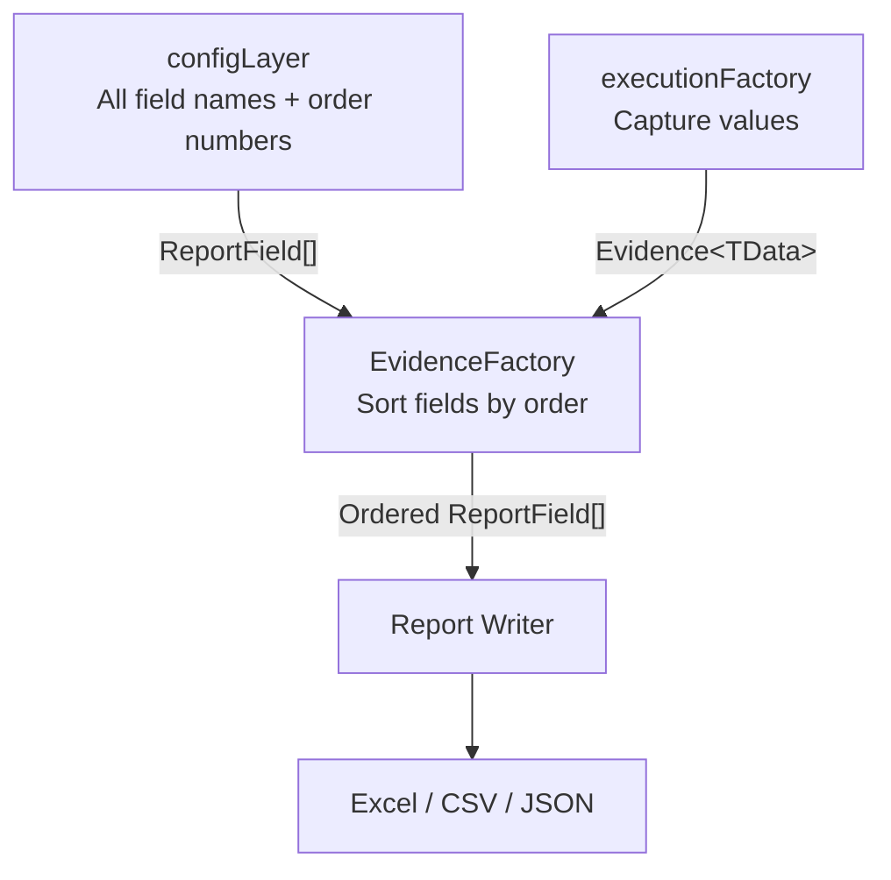

```mermaid

flowchart TD
    CONFIG["configLayer<br/>All field names + order numbers"]
    EXEC["executionFactory<br/>Capture values"]
    FACTORY["EvidenceFactory<br/>Sort fields by order"]
    WRITER["Report Writer"]
    OUTPUT["Excel / CSV / JSON"]

    CONFIG -->|"ReportField[]"| FACTORY
    EXEC -->|"Evidence&lt;TData&gt;"| FACTORY
    FACTORY -->|"Ordered ReportField[]"| WRITER
    WRITER --> OUTPUT
    
```