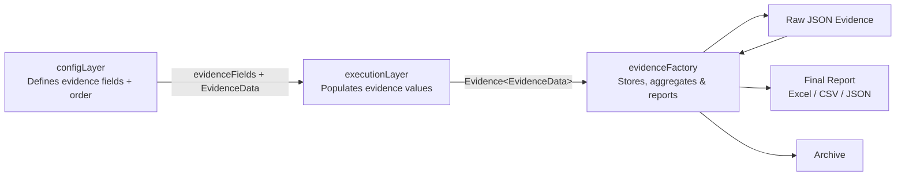
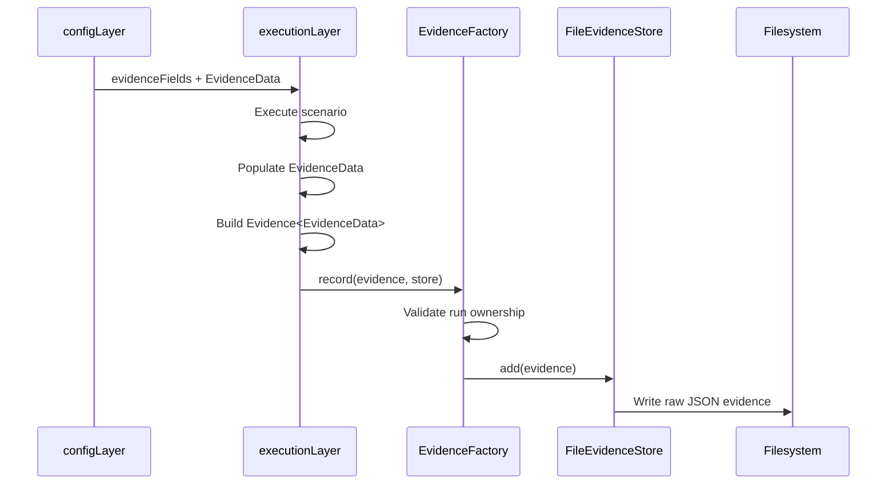
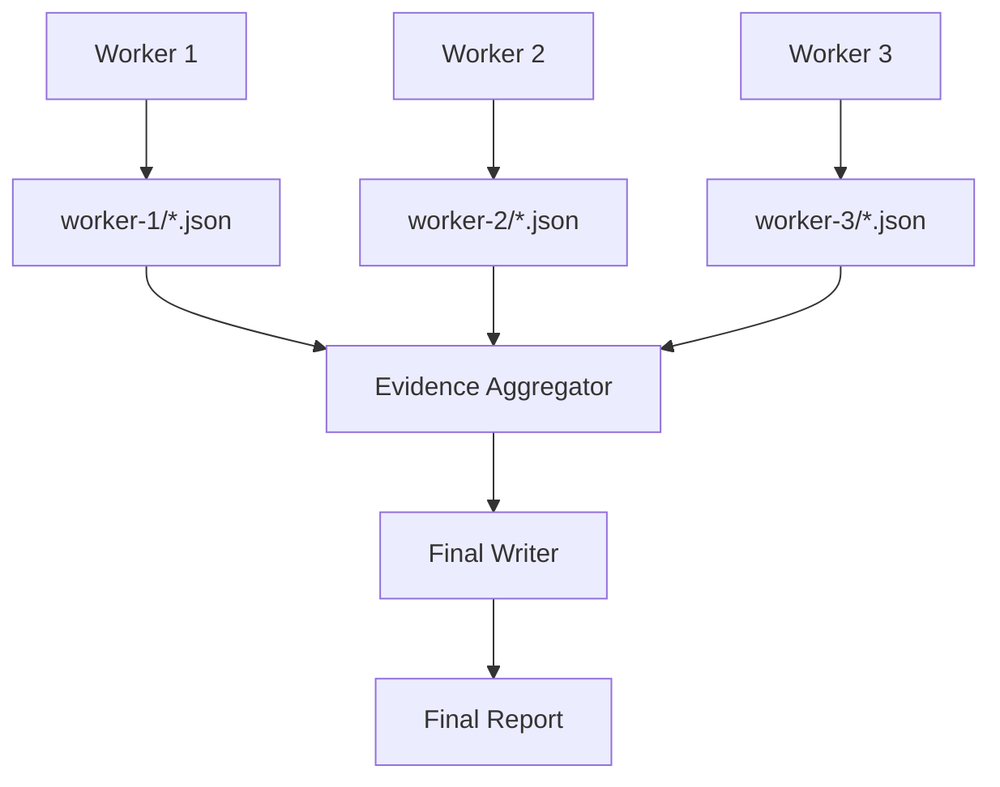
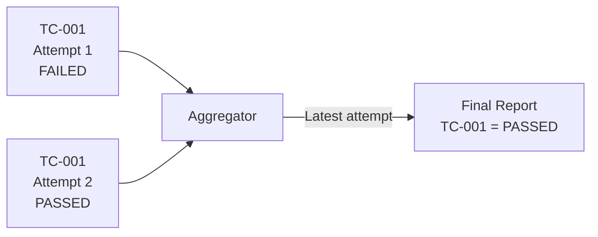
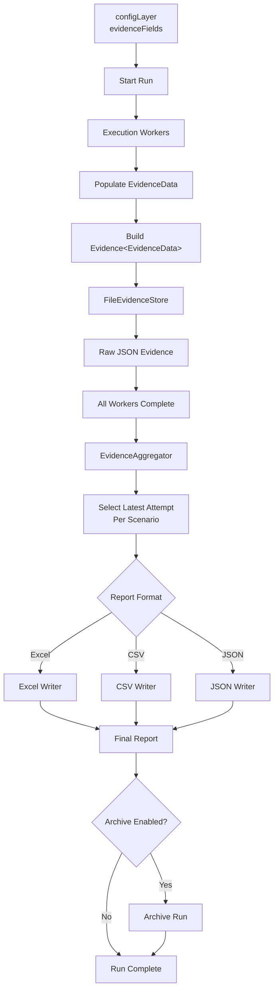
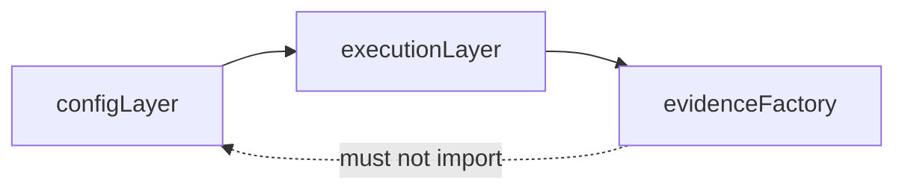

# Evidence Factory

## Overview

`evidenceFactory` is a reusable framework component responsible for collecting, storing, aggregating, reporting, and archiving execution evidence.

It is intentionally **business-field agnostic**.

The Evidence Factory does not define business evidence fields such as:

- `policyNumber`
- `customerNumber`
- `premium`
- `quoteNumber`
- any application-specific field

Business evidence field names and their order are owned by `configLayer`.

The `executionLayer` acts as the bridge between `configLayer` and `evidenceFactory`.

---

# Architecture

The responsibility flow is:



The important ownership rule is:

```text
configLayer      -> owns business field names and order
executionLayer   -> owns/populates business field values
evidenceFactory  -> owns execution metadata and evidence processing
```

---

# Responsibility Boundary

## ConfigLayer-owned fields

Example:

```ts
export const evidenceFields = [
  'policyNumber',
  'customerNumber',
  'premium',
] as const;
```

These fields are defined outside Evidence Factory.

Their position in the array determines their report order.

For example:

```ts
[
  'policyNumber',
  'customerNumber',
  'premium',
]
```

produces report columns in this order:

```text
policyNumber
customerNumber
premium
```

Evidence Factory does not define or duplicate these field names.

---

## EvidenceFactory-owned fields

Evidence Factory owns generic execution metadata:

```text
runId
workerId
attempt
scenarioId
scenarioName
status
startTime
endTime
durationMs
data
error
```

The `data` property contains consumer-owned evidence values.

Example:

```ts
{
  runId: 'RUN-001',
  workerId: 'worker-1',
  attempt: 1,

  scenarioId: 'TC-001',
  scenarioName: 'Create Policy',

  status: EvidenceStatus.PASSED,

  data: {
    policyNumber: 'POL-12345',
    customerNumber: 'CUS-98765',
    premium: 129.50,
  },
}
```

Evidence Factory understands the outer execution structure but does not define the fields inside `data`.

---

# Component Structure

```text
evidenceFactory/
├── aggregation/
│   └── evidence-aggregator.ts
├── archive/
│   ├── archive-cleaner.ts
│   ├── archive-config.ts
│   ├── archive-manager.ts
│   └── archive-policy.ts
├── contracts/
│   ├── evidence-status.ts
│   ├── evidence.ts
│   ├── report-config.ts
│   └── report-format.ts
├── store/
│   ├── evidence-store.ts
│   ├── file-evidence-store.ts
│   └── memory-evidence-store.ts
├── writers/
│   ├── csv/
│   │   └── csv-evidence-writer.ts
│   ├── excel/
│   │   ├── evidence-sheet.ts
│   │   ├── excel-evidence-writer.ts
│   │   ├── excel-style.ts
│   │   └── summary-sheet.ts
│   ├── json/
│   │   └── json-evidence-writer.ts
│   ├── evidence-writer.ts
│   └── writer-factory.ts
├── evidence-factory.ts
├── index.ts
└── README.md
```

---

# Folder and File Details

## `contracts/`

Contains framework-owned contracts used by Evidence Factory.

No consumer/business evidence fields belong in this directory.

### `contracts/evidence.ts`

Defines the generic evidence envelope.

```ts
Evidence<TData>
```

`TData` represents consumer-owned evidence data.

Example:

```ts
Evidence<EvidenceData>
```

The interface contains framework metadata such as:

```text
runId
workerId
attempt
scenarioId
scenarioName
status
startTime
endTime
durationMs
error
```

and the generic:

```ts
data: TData
```

Evidence Factory does not know the internal business structure of `TData`.

---

### `contracts/evidence-status.ts`

Defines framework-supported execution statuses.

```ts
EvidenceStatus.PASSED
EvidenceStatus.FAILED
EvidenceStatus.NOT_EXECUTED
```

These statuses are used for aggregation, reporting, Excel sheets, and summary counts.

---

### `contracts/report-format.ts`

Defines the supported final report formats.

```ts
ReportFormat.EXCEL
ReportFormat.CSV
ReportFormat.JSON
```

A report generation request selects one format.

---

### `contracts/report-config.ts`

Defines final report configuration.

It contains properties such as:

```text
format
outputDir
fileName
reportTitle
environment
```

Example:

```ts
{
  format: ReportFormat.EXCEL,
  outputDir: './results/RUN-001/report',
  fileName: 'execution-report',
  reportTitle: 'Automation Execution Report',
  environment: 'QA',
}
```

---

# `store/`

Contains raw evidence storage implementations.

Workers should write raw evidence through an `EvidenceStore`.

Workers should **not write directly to Excel, CSV, or the final JSON report**.

---

### `store/evidence-store.ts`

Defines the generic evidence storage contract.

```ts
add()
getAll()
clear()
```

Any evidence storage implementation must implement this interface.

---

### `store/file-evidence-store.ts`

Filesystem-based evidence storage.

This is the main store for multi-worker execution.

Each worker writes into its own directory.

Example:

```text
results/
└── RUN-001/
    └── evidence/
        ├── worker-0/
        │   ├── TC-001_attempt-1.json
        │   └── TC-003_attempt-1.json
        └── worker-1/
            └── TC-002_attempt-1.json
```

The file naming convention is:

```text
<scenarioId>_attempt-<attempt>.json
```

Example:

```text
TC-001_attempt-1.json
TC-001_attempt-2.json
```

This allows Evidence Factory to preserve retry history.

Each worker gets its own `FileEvidenceStore`.

Example:

```ts
const store = new FileEvidenceStore<EvidenceData>({
  resultsDir: './results',
  runId,
  workerId,
});
```

---

### `store/memory-evidence-store.ts`

Stores evidence in memory.

Useful primarily for:

- unit tests
- component tests
- temporary execution
- situations where filesystem persistence is unnecessary

Evidence is lost when the process terminates.

---

# `aggregation/`

Contains evidence aggregation logic.

### `aggregation/evidence-aggregator.ts`

Reads evidence generated by all workers for a run.

Example:

```text
worker-0/
    TC-001_attempt-1.json

worker-1/
    TC-002_attempt-1.json

worker-2/
    TC-001_attempt-2.json
```

The aggregator can return:

### All attempts

```ts
getAllAttempts()
```

This preserves the complete execution history.

### Final evidence

```ts
getLatestAttempts()
```

This selects the latest attempt for each scenario.

For example:

```text
TC-001 attempt 1 FAILED
TC-001 attempt 2 PASSED
```

The final report uses:

```text
TC-001 attempt 2 PASSED
```

while the raw evidence files preserve both attempts.

The aggregator also detects conflicting duplicate scenario/attempt combinations.

---

# `writers/`

Contains final report generation.

Writers receive:

1. aggregated evidence
2. ordered business field names
3. report configuration

They do not define business fields.

---

### `writers/evidence-writer.ts`

Defines the common writer interface.

Conceptually:

```ts
write(
  evidence,
  fields,
  reportConfig,
)
```

The `fields` parameter comes from `configLayer`.

Example:

```ts
[
  'policyNumber',
  'customerNumber',
  'premium',
]
```

---

### `writers/writer-factory.ts`

Selects the correct writer according to:

```ts
ReportFormat.EXCEL
ReportFormat.CSV
ReportFormat.JSON
```

Execution code does not need to manually instantiate the individual writer.

---

# CSV Writer

## `writers/csv/csv-evidence-writer.ts`

Creates the final CSV report.

Framework columns are written first:

```text
Scenario ID
Scenario Name
Status
Attempt
Worker
Start Time
End Time
Duration (ms)
```

Consumer fields are then written in exactly the order supplied by `configLayer`.

For example:

```text
policyNumber
customerNumber
premium
```

Finally:

```text
Error
```

Result:

```text
Scenario ID
Scenario Name
Status
Attempt
Worker
Start Time
End Time
Duration (ms)
policyNumber
customerNumber
premium
Error
```

The writer does not sort or redefine consumer fields.

---

# JSON Writer

## `writers/json/json-evidence-writer.ts`

Creates the final aggregated JSON report.

JSON preserves the evidence structure directly.

Example:

```json
{
  "metadata": {
    "reportTitle": "Automation Execution Report",
    "environment": "QA",
    "generatedAt": "...",
    "total": 1
  },
  "evidence": [
    {
      "runId": "RUN-001",
      "workerId": "worker-0",
      "attempt": 1,
      "scenarioId": "TC-001",
      "scenarioName": "Create Policy",
      "status": "PASSED",
      "data": {
        "policyNumber": "POL-12345",
        "customerNumber": "CUS-98765",
        "premium": 129.5
      }
    }
  ]
}
```

---

# Excel Writer

## `writers/excel/excel-evidence-writer.ts`

Coordinates creation of the final Excel workbook.

The workbook contains:

```text
Summary
All
Passed
Failed
Not Executed
```

The writer filters evidence by status and delegates worksheet creation.

---

### `writers/excel/evidence-sheet.ts`

Creates evidence worksheets.

It creates:

- framework columns
- consumer columns
- error column

Consumer columns are created from the ordered field list supplied by `configLayer`.

For example:

```ts
[
  'policyNumber',
  'customerNumber',
  'premium',
]
```

produces Excel columns in the same order.

The file contains no business-specific field definitions.

---

### `writers/excel/summary-sheet.ts`

Creates the `Summary` worksheet.

The summary includes execution information such as:

```text
Run ID
Environment
Generated At
Total
Passed
Failed
Not Executed
Pass Rate
```

This information is framework-owned and therefore belongs inside Evidence Factory.

---

### `writers/excel/excel-style.ts`

Contains reusable Excel styling functions.

It controls:

- header styling
- body cell styling
- status styling
- borders
- worksheet header colors

Status colors are applied for:

```text
Passed
Failed
Not Executed
```

This file contains presentation logic only.

---

# `archive/`

Contains completed-run archive and retention functionality.

Archiving occurs at coordinator/run level, not worker level.

Workers should never independently archive execution results.

---

### `archive/archive-config.ts`

Defines archive configuration.

Example responsibilities:

```text
enabled
archive directory
archive policy
```

---

### `archive/archive-policy.ts`

Defines archive behavior such as:

```text
compress
deleteSourceAfterArchive
retentionDays
cleanupAfterRun
```

---

### `archive/archive-manager.ts`

Coordinates run archiving.

After report generation, the complete run directory can be compressed.

Example:

```text
results/
└── RUN-001/
```

becomes:

```text
archive/
└── RUN-001.zip
```

If configured, the source run directory can be deleted only after successful archive creation.

---

### `archive/archive-cleaner.ts`

Applies archive retention rules.

For example:

```text
retentionDays = 30
```

allows expired ZIP archives to be removed.

Cleanup is performed at run/coordinator level.

---

# `evidence-factory.ts`

This is the main Evidence Factory coordinator.

It connects:

```text
store
aggregation
writers
archive
```

Main responsibilities include:

```ts
record()
generateReport()
getAllAttempts()
getFinalEvidence()
archiveRun()
finalize()
```

---

## `record()`

Records evidence using a supplied `EvidenceStore`.

Example:

```ts
await evidenceFactory.record(
  evidence,
  store,
);
```

Evidence Factory validates framework ownership such as `runId`.

It does not validate or define consumer business fields.

---

## `getAllAttempts()`

Returns every scenario attempt stored for the run.

Useful for diagnostics and execution history.

---

## `getFinalEvidence()`

Returns only the latest attempt for every scenario.

This is what final reporting uses.

---

## `generateReport()`

Aggregates final evidence and selects the appropriate writer.

The configured evidence field order is passed to CSV/Excel writers.

---

## `archiveRun()`

Archives the complete run directory when archive configuration is available.

---

## `finalize()`

Coordinates final run processing:

```text
aggregate
   ↓
generate report
   ↓
archive run (when enabled)
```

---

# `index.ts`

Defines the public API of Evidence Factory.

Execution code should normally import public Evidence Factory components from:

```ts
import {
  EvidenceFactory,
  EvidenceStatus,
  FileEvidenceStore,
  ReportFormat,
} from '../evidenceFactory';
```

rather than importing internal implementation files directly.

Internal classes such as individual writers and aggregation implementation details remain encapsulated.

---

# ConfigLayer Integration

The business evidence configuration lives outside Evidence Factory.

Example:

```text
configLayer/
└── schema/
    └── evidence/
        └── evidence-schema.ts
```

Example configuration:

```ts
export const evidenceFields = [
  'policyNumber',
  'customerNumber',
  'premium',
] as const;

export type EvidenceField =
  typeof evidenceFields[number];

export type EvidenceData = Partial<
  Record<EvidenceField, unknown>
>;
```

This file is the single source of truth for:

```text
business evidence field names
business evidence field order
```

Evidence Factory must not duplicate these fields.

---

# How ExecutionLayer Uses Evidence Factory

The `executionLayer` is responsible for connecting the consumer configuration with Evidence Factory.

## Step 1 — Import consumer evidence configuration

```ts
import {
  evidenceFields,
  type EvidenceData,
} from '../configLayer/schema/evidence/evidence-schema';
```

---

## Step 2 — Import Evidence Factory

```ts
import {
  EvidenceFactory,
  EvidenceStatus,
  FileEvidenceStore,
  ReportFormat,
  type Evidence,
} from '../evidenceFactory';
```

---

## Step 3 — Create EvidenceFactory

The coordinator creates one Evidence Factory for the run.

```ts
const evidenceFactory =
  new EvidenceFactory<EvidenceData>({
    fields: evidenceFields,
    resultsDir: './results',
    runId,
  });
```

This is the runtime connection between `configLayer` and Evidence Factory.

Evidence Factory receives the field names/order but does not own them.

---

## Step 4 — Create a worker store

Each execution worker creates its own filesystem store.

```ts
const store =
  new FileEvidenceStore<EvidenceData>({
    resultsDir: './results',
    runId,
    workerId,
  });
```

Workers do not share the same raw evidence file.

---

## Step 5 — Execution populates business evidence

Execution code creates values using `EvidenceData`.

```ts
const data: EvidenceData = {
  policyNumber: 'POL-12345',
  customerNumber: 'CUS-98765',
  premium: 129.50,
};
```

The values come from application execution.

Evidence Factory does not generate these values.

---

## Step 6 — Build the Evidence envelope

```ts
const evidence: Evidence<EvidenceData> = {
  runId,
  workerId,
  attempt: 1,

  scenarioId: 'TC-001',
  scenarioName: 'Create Policy',

  status: EvidenceStatus.PASSED,

  startTime: new Date().toISOString(),
  endTime: new Date().toISOString(),

  data,
};
```

For failed execution:

```ts
const evidence: Evidence<EvidenceData> = {
  runId,
  workerId,
  attempt: 1,

  scenarioId: 'TC-002',
  scenarioName: 'Update Policy',

  status: EvidenceStatus.FAILED,

  data: {
    policyNumber: 'POL-12345',
  },

  error: {
    message: 'Policy update failed',
  },
};
```

---

## Step 7 — Record evidence

The worker sends the evidence to Evidence Factory:

```ts
await evidenceFactory.record(
  evidence,
  store,
);
```

The filesystem store writes:

```text
results/
└── <runId>/
    └── evidence/
        └── <workerId>/
            └── <scenarioId>_attempt-<attempt>.json
```

---

# Worker Execution Flow



---

# Multi-Worker Execution

Evidence Factory is designed so workers do not compete for a single Excel/CSV file.

Example:



This avoids concurrent workers trying to modify the same final report.

---

# Retry Handling

Every attempt is stored independently.

Example:

```text
worker-0/
└── TC-001_attempt-1.json

worker-2/
└── TC-001_attempt-2.json
```

A retry may run on a different worker.

The aggregator therefore determines the latest attempt by:

```text
scenarioId + attempt
```

rather than assuming all retries belong to the same worker.

Example:

```text
TC-001 attempt 1 -> FAILED
TC-001 attempt 2 -> PASSED
```

Raw evidence keeps both attempts.

The final report contains attempt 2.



---

# Final Report Generation

After all workers finish, the coordinator generates the final report.

Example:

```ts
const report =
  await evidenceFactory.generateReport({
    format: ReportFormat.EXCEL,

    outputDir:
      `./results/${runId}/report`,

    fileName:
      'execution-report',

    reportTitle:
      'Automation Execution Report',

    environment:
      'QA',
  });
```

Result:

```text
results/
└── RUN-001/
    ├── evidence/
    │   ├── worker-0/
    │   ├── worker-1/
    │   └── worker-2/
    └── report/
        └── execution-report.xlsx
```

For CSV:

```ts
format: ReportFormat.CSV
```

produces:

```text
execution-report.csv
```

For JSON:

```ts
format: ReportFormat.JSON
```

produces:

```text
execution-report.json
```

---

# Complete Execution Lifecycle



---

# Finalization

If archiving is configured, the coordinator can perform reporting and archiving together:

```ts
const result =
  await evidenceFactory.finalize({
    format: ReportFormat.EXCEL,
    outputDir: `./results/${runId}/report`,
    fileName: 'execution-report',
    reportTitle: 'Automation Execution Report',
    environment: 'QA',
  });
```

Conceptually:

```text
Workers complete
      ↓
Read raw evidence
      ↓
Aggregate attempts
      ↓
Select latest attempt
      ↓
Generate selected report
      ↓
Archive run if enabled
      ↓
Apply archive cleanup policy if configured
```

---

# Recommended Results Structure

```text
results/
└── <runId>/
    ├── evidence/
    │   ├── worker-0/
    │   │   ├── TC-001_attempt-1.json
    │   │   └── TC-003_attempt-1.json
    │   ├── worker-1/
    │   │   └── TC-002_attempt-1.json
    │   └── worker-2/
    │       └── TC-001_attempt-2.json
    └── report/
        └── execution-report.xlsx
```

Archived runs:

```text
archive/
└── <runId>.zip
```

---

# Dependency Direction

The following dependency direction must be preserved:



Correct:

```text
configLayer
     ↓
executionLayer
     ↓
evidenceFactory
```

Incorrect:

```text
evidenceFactory
     ↓
configLayer
```

Evidence Factory must remain reusable and independent from consumer-specific configuration.

---

# Important Design Rules

1. Business evidence fields are maintained only in `configLayer`.

2. Field array position determines business-column order.

3. Evidence Factory must not contain consumer/business field names.

4. Execution Layer populates business evidence values.

5. Execution Layer combines `EvidenceData` with generic `Evidence<TData>`.

6. Workers write raw JSON evidence only.

7. Workers must not directly write to the final Excel/CSV report.

8. Each worker writes to its own evidence directory.

9. Every retry attempt is preserved as raw evidence.

10. Final reporting uses the latest attempt for each scenario.

11. Excel, CSV, and JSON writers remain generic.

12. Final report generation occurs once at coordinator level.

13. Archiving occurs once after final report generation.

14. Evidence Factory must not import consumer-specific evidence configuration.

---

# Example End-to-End Usage

```ts
import {
  evidenceFields,
  type EvidenceData,
} from '../configLayer/schema/evidence/evidence-schema';

import {
  EvidenceFactory,
  EvidenceStatus,
  FileEvidenceStore,
  ReportFormat,
  type Evidence,
} from '../evidenceFactory';

const runId = 'RUN-001';
const workerId = 'worker-0';

const evidenceFactory =
  new EvidenceFactory<EvidenceData>({
    fields: evidenceFields,
    resultsDir: './results',
    runId,
  });

const store =
  new FileEvidenceStore<EvidenceData>({
    resultsDir: './results',
    runId,
    workerId,
  });

const evidence: Evidence<EvidenceData> = {
  runId,
  workerId,
  attempt: 1,

  scenarioId: 'TC-001',
  scenarioName: 'Create Policy',

  status: EvidenceStatus.PASSED,

  startTime:
    new Date().toISOString(),

  endTime:
    new Date().toISOString(),

  data: {
    policyNumber: 'POL-12345',
    customerNumber: 'CUS-98765',
    premium: 129.50,
  },
};

await evidenceFactory.record(
  evidence,
  store,
);

// Run once after all workers have completed.
await evidenceFactory.generateReport({
  format: ReportFormat.EXCEL,
  outputDir:
    `./results/${runId}/report`,
  fileName:
    'execution-report',
  reportTitle:
    'Automation Execution Report',
  environment:
    'QA',
});
```

---

# Summary

Evidence Factory provides a generic evidence-processing pipeline:

```text
Execution
   ↓
Evidence<TData>
   ↓
Raw JSON storage
   ↓
Aggregation
   ↓
Latest-attempt selection
   ↓
Excel / CSV / JSON report
   ↓
Archive
```

The business evidence model remains outside the component:

```text
configLayer
   ↓
field names + order

executionLayer
   ↓
field values

evidenceFactory
   ↓
generic processing
```

This separation keeps Evidence Factory reusable across different applications, products, and automation suites without modifying the component whenever business evidence requirements change.
