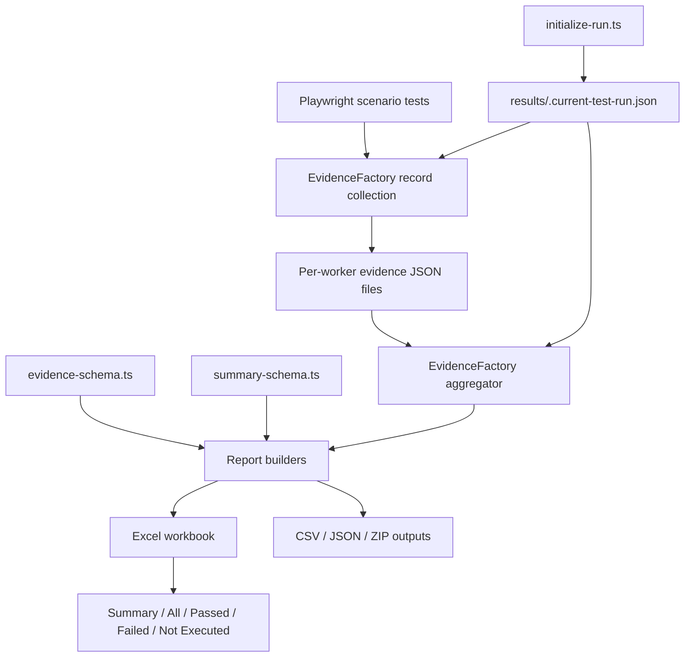
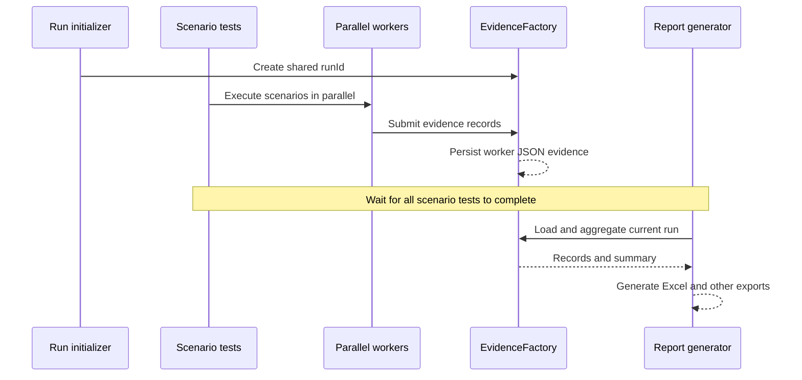
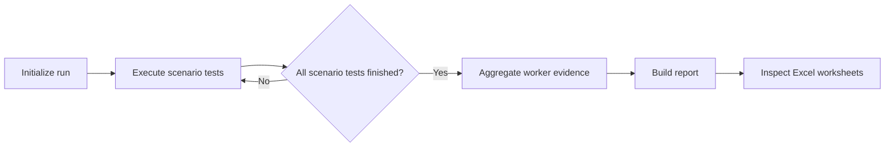

# EvidenceFactory

> **Scope:** Evidence capture, run-level aggregation, and Excel/CSV/JSON/ZIP reporting for the Playwright TypeScript framework.
>
> **Implementation note:** This guide reflects the project structure and test workflow discussed for the current framework. The repository source files were not provided for inspection, so exact public API names, internal renderer filenames, and style constants must be confirmed in your checkout. Examples marked *illustrative* are not copy-paste API contracts.

## 1. Overview

`evidenceFactory` separates **collecting evidence during test execution** from **producing a consolidated report**. Individual scenarios record evidence independently (including when Playwright runs multiple workers). A later reporting step reads the evidence for the current run and produces reviewable artifacts.

### Capabilities

| Capability | Description |
|---|---|
| Run identification | A shared `runId` associates scenario evidence and the final report with the same execution. |
| Parallel-worker evidence | Individual workers write evidence records that are aggregated after scenario execution. |
| Business evidence | Captures scenario identifiers, policy/customer identifiers, premium, and other configured values. |
| Execution metadata | Records status, attempt, worker, timing, and error details. |
| Schema-driven columns | Uses `configLayer/schema/evidence/evidence-schema.ts` to define Excel evidence columns and their display order. |
| Schema-driven summary | Uses `configLayer/schema/evidence/summary-schema.ts` to define summary sections and fields. |
| Multiple outputs | Supports Excel, CSV, JSON, and ZIP exports in the framework's reporting workflow. |
| Excel filtering | The workbook contains `Summary`, `All`, `Passed`, `Failed`, and `Not Executed` worksheets. |
| Run-level metrics | Summarizes totals, passed/failed/not-executed counts, pass rate, and execution timing. |

## 2. Architecture



### Main locations

| Location | Responsibility |
|---|---|
| `evidenceFactory/` | Evidence collection, aggregation, and export implementation. |
| `configLayer/schema/evidence/evidence-schema.ts` | Evidence column definitions: field, label, order. |
| `configLayer/schema/evidence/summary-schema.ts` | Summary groups, fields, and display order. |
| `tests/framework/evidence-factory/initialize-run.ts` | Creates the shared current-run metadata file. |
| `tests/framework/evidence-factory/evidence-factory-excel.spec.ts` | Four scenario-based evidence tests. |
| `tests/framework/evidence-factory/evidence-report.spec.ts` | Aggregates evidence and generates/checks the Excel report. |
| `results/.current-test-run.json` | Pointer/metadata for the active run. |
| `results/<runId>/report/` | Expected report output folder for the active run. |

## 3. How evidence files reach EvidenceFactory

Evidence files are **generated by the framework while tests run**; they are not files you normally copy into `evidenceFactory/` manually.

1. Run initialization creates `results/.current-test-run.json` containing the shared run identifier.
2. The scenario tests invoke the framework's evidence-recording implementation.
3. Each parallel worker writes evidence data as JSON into the run's evidence storage.
4. After all scenarios finish, the report test reads the current run identifier and gathers its evidence records.
5. The aggregator combines records, calculates summary metrics, and passes the data to the report exporters.
6. Exporters create the workbook and any configured additional artifacts under the run's output directories.



**Important:** The exact JSON evidence subdirectory and filenames are implementation-specific. Inspect the path construction in `evidenceFactory/` rather than assuming that the evidence files are stored directly inside the package source folder.

## 4. Evidence fields and schema configuration

The evidence schema currently describes the following ordered fields:

`scenarioId`, `scenarioName`, `status`, `policyNumber`, `customerNumber`, `premium`, `attempt`, `workerId`, `startTime`, `endTime`, `durationMs`, `error`.

Each configured column has:

- `field` — key used to retrieve the value from an evidence record;
- `label` — human-readable Excel header;
- `order` — position in the report.

To **rename or reorder evidence columns**, edit:

```text
configLayer/schema/evidence/evidence-schema.ts
```

The summary schema is organized into these groups:

| Section | Fields |
|---|---|
| Run | `runId`, `mode`, `environment`, `evidenceDirectory` |
| Runtime | `machineName`, `user`, `platform`, `osVersion` |
| Browser | `browser`, `browserChannel`, `browserVersion`, `headless` |
| Results | `totalItems`, `passed`, `failed`, `notExecuted`, `passRate` |
| Timing | `executionTime`, `startedAt`, `finishedAt` |

To **rename or reorder summary labels/sections**, edit:

```text
configLayer/schema/evidence/summary-schema.ts
```

Changing a schema label is different from changing the underlying data field. If you add a new `field`, ensure the evidence producer or summary builder actually supplies that value.

## 5. Excel workbook structure

| Worksheet | Content |
|---|---|
| `Summary` | Run, machine, browser, results, and timing metadata. |
| `All` | Every collected scenario evidence record. |
| `Passed` | Records whose evidence status is passed. |
| `Failed` | Records whose evidence status is failed. |
| `Not Executed` | Records whose evidence status is not executed. |

**Status distinction:** A test may *pass as a Playwright test* while deliberately recording `Failed` or `Not Executed` as **sample evidence data**. The example evidence tests exercise the reporting categories; their evidence statuses are not necessarily the same as the Playwright runner result.

## 6. Where to change Excel report colors

**Change colors in the Excel workbook rendering/styling code inside `evidenceFactory/`, not in the evidence or summary schemas.** The schema files control the content, labels, and order; they do not establish the workbook's visual palette.

Because the current source was not supplied, the exact styling filename cannot be verified. Find the implementation by searching for the workbook creation and cell style assignments:

```powershell
Get-ChildItem .\evidenceFactory -Recurse -File -Filter *.ts |
  Select-String -Pattern 'ExcelJS|Workbook|\.fill\s*=|\.font\s*=|\.border\s*=|argb|fgColor|bgColor|headerColor|statusColor'
```

Inspect the matched file(s), especially code that styles the `Summary` sheet, column headers, status cells, and sheet tabs. Common ExcelJS patterns look like this (**illustrative only**):

```ts
// Example of what to look for in the actual Excel renderer.
headerCell.fill = {
  type: 'pattern',
  pattern: 'solid',
  fgColor: { argb: 'FF17365D' },
};
headerCell.font = { bold: true, color: { argb: 'FFFFFFFF' } };
```

ExcelJS generally uses **ARGB** color strings (`AARRGGBB`): `FF17365D` is an opaque dark blue, `FFFFFFFF` is opaque white. Update the existing style values or, preferably, centralize them into a single palette object if the renderer currently repeats them.

Suggested palette roles to locate and maintain:

| Role | Example ARGB | Typical usage |
|---|---|---|
| Primary/header | `FF17365D` | Table headers and section headings |
| Header text | `FFFFFFFF` | Text on dark backgrounds |
| Passed | `FF198754` | Passed status highlighting |
| Failed | `FFDC3545` | Failed status highlighting |
| Not executed | `FFFFC107` | Not-executed status highlighting |
| Alternate row | `FFF3F6FA` | Zebra-striped table rows |

These are **suggested colors**, not a claim about the current workbook colors. After editing, rerun report generation and inspect all five worksheets.

## 7. How to use EvidenceFactory in execution

### Prerequisites

From the repository root, install the npm dependencies and the Playwright browser as required by the tests:

```powershell
npm ci
npx --no-install playwright install chromium
```

On a corporate Windows device, configure the trusted CA and proxy first, or use the repository's `scripts/windows/setup-playwright.ps1` setup script.

### Recommended execution sequence (PowerShell)

Run these commands **in order**:

```powershell
# 1. Create a shared run ID.
npx --no-install tsx tests/framework/evidence-factory/initialize-run.ts
if ($LASTEXITCODE -ne 0) { throw 'Run initialization failed' }

# 2. Produce evidence records using parallel scenario tests.
npx --no-install playwright test tests/framework/evidence-factory/evidence-factory-excel.spec.ts --project=framework --workers=4
if ($LASTEXITCODE -ne 0) { throw 'Evidence scenario tests failed' }

# 3. Aggregate evidence and generate the Excel report.
npx --no-install playwright test tests/framework/evidence-factory/evidence-report.spec.ts --project=framework --workers=1
if ($LASTEXITCODE -ne 0) { throw 'Evidence report generation failed' }

# 4. Open the run's report directory.
$runId = (Get-Content .\results\.current-test-run.json | ConvertFrom-Json).runId
explorer ".\results\$runId\report"
```

On macOS/Linux, use the same three `npx` commands in sequence (without the PowerShell `if` lines) and inspect `results/<runId>/report/`.

### Execution lifecycle



### Using the recorder in your own tests

The supported integration pattern is to **use the same EvidenceFactory recording API already demonstrated by**:

```text
tests/framework/evidence-factory/evidence-factory-excel.spec.ts
```

When adapting a scenario, supply the scenario/business values available at runtime (for example `scenarioId`, `scenarioName`, `policyNumber`, `customerNumber`, `premium`) and allow the framework's recorder to attach execution metadata as implemented. **Copy the actual imports and method call from that spec**; the recorder's exported symbol and parameter signature have not been verified here.

Do not manually fabricate worker JSON files unless you are deliberately testing the aggregator.

## 8. Run output and troubleshooting

Typical run organization:

```text
results/
├── .current-test-run.json
└── <runId>/
    ├── ... worker evidence JSON files (exact path varies) ...
    └── report/
        └── ... generated report artifacts ...
```

| Symptom | Likely cause | Action |
|---|---|---|
| `ENOENT ... .current-test-run.json` | Run initializer was not executed. | Run `initialize-run.ts` first. |
| Empty or incomplete workbook | Report started before scenarios finished, or evidence was written to another run. | Finish scenario command before starting report command; check `runId`. |
| Columns missing or out of order | Schema and recorded data are inconsistent. | Check `evidence-schema.ts` and evidence-producing code. |
| Summary fields empty | Missing runtime/browser metadata or mismatched summary keys. | Check `summary-schema.ts` and summary data producer. |
| Unexpected workbook colors | Styling is set in renderer code, not schema files. | Search the workbook writer for `fill`, `font`, `argb`, and status styling. |
| `browserType.launch` executable missing | Playwright browser binaries are not installed. | Run `npx --no-install playwright install chromium`. |
| Browser download `ECONNRESET` | Download connection is reset, potentially by a corporate proxy. | Detect Windows-selected proxy and set `HTTPS_PROXY` / `HTTP_PROXY` using approved network settings. |

### Avoid a full-suite ordering race

Do not assume `npx playwright test --project=framework` will always run `evidence-report.spec.ts` after `evidence-factory-excel.spec.ts`. Playwright may execute different files concurrently. Keep the explicit sequence above until the project is reconfigured with an enforced setup/scenario/report workflow. See the [Playwright project dependencies documentation](https://playwright.dev/docs/test-projects) for one supported orchestration mechanism.

## 9. Maintenance checklist

- When changing **evidence columns**, update `evidence-schema.ts` and the record producer if needed.
- When changing **summary sections**, update `summary-schema.ts` and the summary producer if needed.
- When changing **Excel colors or fonts**, update the Excel renderer's style definitions.
- When adding a **new export format**, update the relevant EvidenceFactory exporter and its tests.
- When changing **run storage**, keep initialization, evidence writing, aggregation, and report output paths consistent.
- After any change, regenerate the report and review `Summary`, `All`, `Passed`, `Failed`, and `Not Executed`.

---

**Documentation accuracy:** Field names, test commands, and workbook sheet names above are based on the current framework workflow described in this project discussion. The precise internal API and Excel styling file should be checked against the repository before treating those details as definitive.
